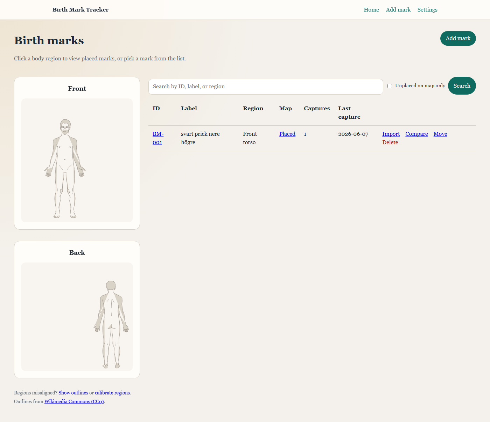
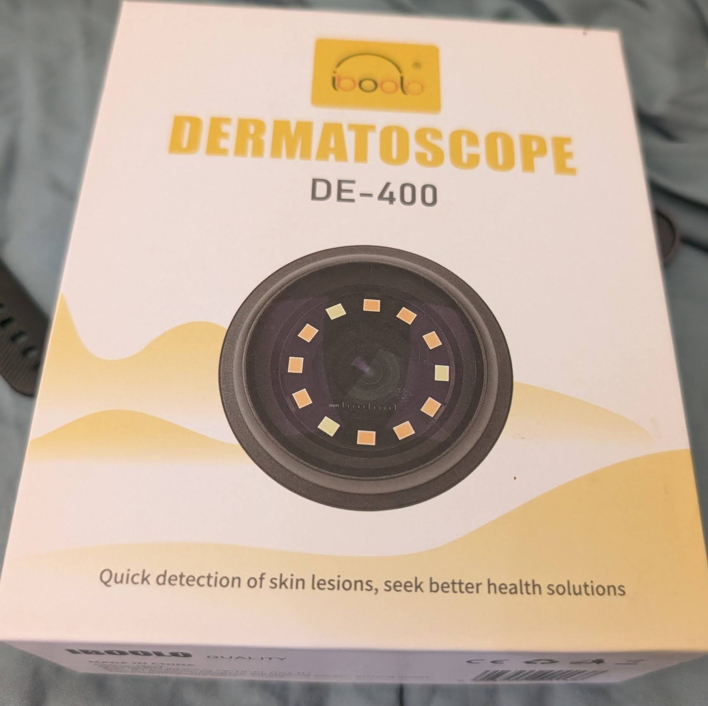
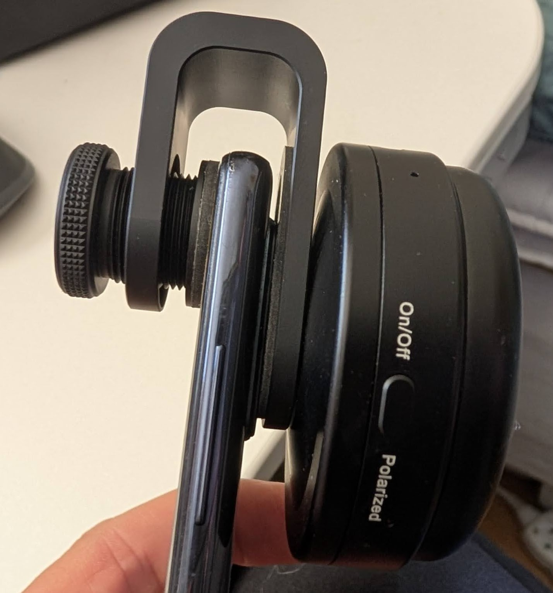
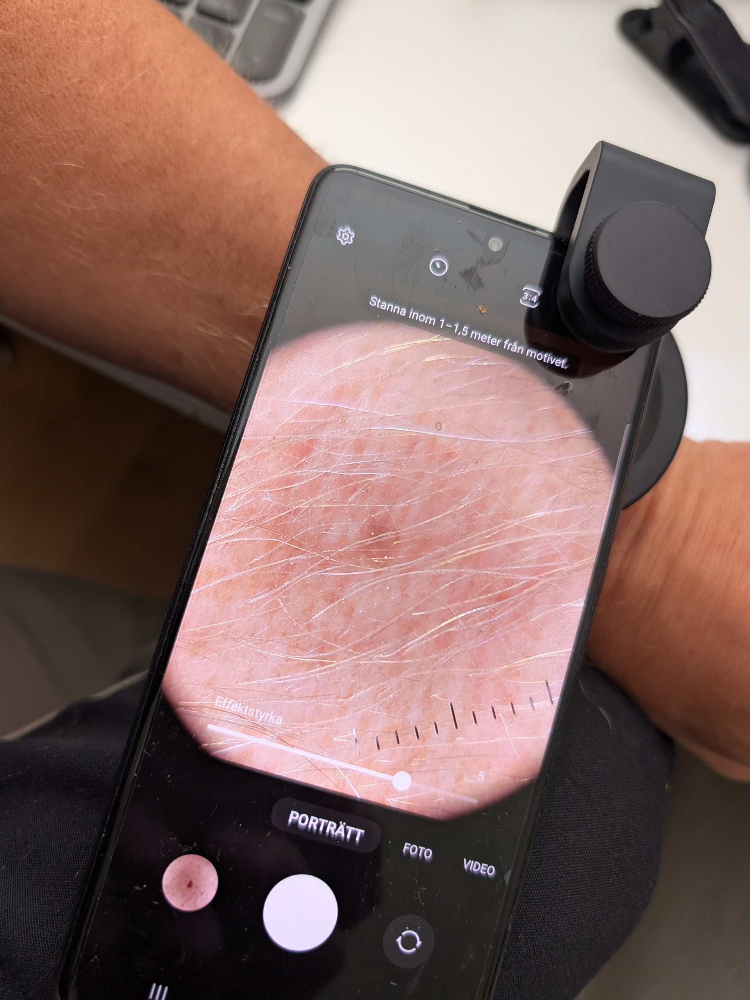

# Birth Mark Tracker

Local-first web app for tracking dermatoscope photos of birth marks over time. Register marks, import JPEG/HEIC photos with EXIF dates, and compare any two captures side by side.

## Requirements

- Python 3.11+
- Windows, macOS, or Linux

## Setup

Install dependencies once into your standard Python environment:

```bash
cd "c:\JCCODE\#clazzoni\claz012-birthmark-logger"
python -m pip install -r requirements.txt
```

## Run

From the project folder, using your normal `python`:

```bash
python -m app.main
```

This starts uvicorn on **127.0.0.1:8000** with auto-reload enabled (code changes restart the server).

Or, without auto-reload:

```bash
python -m uvicorn app.main:app --host 127.0.0.1 --port 8000
```

Open [http://127.0.0.1:8000](http://127.0.0.1:8000) in your browser.



The **home page** shows front and back body maps on the left and your mark list on the right. Click a region on the map or a mark in the table to open it.

## Stop

If the server is running in a terminal you can find, press **Ctrl+C** once or twice.

If you do not know which terminal started it, stop whatever is listening on port 8000.

**Windows (PowerShell):**

```powershell
Get-NetTCPConnection -LocalPort 8000 -State Listen -ErrorAction SilentlyContinue |
  ForEach-Object { Stop-Process -Id $_.OwningProcess -Force }
```

With auto-reload enabled, a worker process may keep the port open after the parent exits. If the port is still in use, run the command again or stop any remaining `python` processes tied to this app.

**macOS / Linux:**

```bash
lsof -ti:8000 | xargs kill
```

## Workflow

1. **Add a mark** — give it a label (e.g. "left upper back") and optional body region and notes.
2. **Import photos** — open the mark → **Import photos**. Add JPEG, HEIC, or PNG images (see [Importing photos](#importing-photos) below). EXIF capture dates are read automatically; edit them on the review screen if needed, then save.
3. **Compare** — pick any two capture dates for the same mark and view them side by side.

## Capturing photos with a dermatoscope

Photos are taken on a phone with a clip-on dermatoscope, then imported into the app from Google Photos (see [Google Photos workflow](#google-photos-workflow)).

### Hardware setup

The setup used here is an **iboolo DE-400** dermatoscope clipped over the phone’s rear camera:



The clip mounts over the camera lens. Use the **On/Off** switch and **Polarized** mode on the side of the attachment as needed:



### Taking a capture

Open the phone’s camera app and photograph the birth mark through the dermatoscope. The live view shows a magnified circular image; a **millimetre scale** appears along the bottom of the frame — keep it visible when you want size reference in the photo.



After capture, photos sync to Google Photos on the phone. Download them on your computer and import into the mark (see below).

## Importing photos

Pick a mark, then **Import photos**. Supported formats: **JPEG**, **HEIC**, **PNG**.

After files are added, review capture dates (from EXIF when available), then **Save photos**. Duplicates already stored for that mark are skipped automatically.

### Upload through the browser

On the import page you can:

- **Drag and drop** files or a ZIP onto the drop zone (upload starts immediately on drop)
- **Choose files** — pick one or more images
- **Choose folder** — pick a whole folder (useful after unzipping a Google Photos download)
- **Upload and review dates** — if you chose files without dropping, click this to continue

ZIP archives from Google Photos exports are supported; the app extracts images inside and skips non-image files.

### Import from a folder on this computer

If photos are already on disk, use **Import from folder on this computer** instead of re-uploading through the browser:

1. Enter the folder path (e.g. `C:\Users\you\Downloads\Google Photos`)
2. Click **Scan folder and review dates**

The app reads files directly from that path (including subfolders). Allowed locations: your home folder, Downloads, the app `data/` folder, or a path saved in **Settings**.

To avoid typing the path each time, set a **Default import folder** under [Settings](http://127.0.0.1:8000/settings).

## Google Photos workflow

There is no Google Photos login in the app — download to your computer first, then import locally.

1. Take dermatoscope photos on your phone (they sync to Google Photos as usual).
2. On your computer, download the photos from Google Photos:
   - Selected photos as files, or
   - A **ZIP** export, or
   - An unzipped folder after export
3. In Birth Mark Tracker: open the mark → **Import photos**, then use whichever fits:
   - Drag the **ZIP** onto the drop zone
   - **Choose folder** (or **Scan folder**) for an unzipped download folder
   - **Choose files** or drag-and-drop for a smaller batch

Tip: import one mark at a time — pick the mark first, then add only the photos for that birth mark.

## Body map

The **home page** shows the front and back body maps on the left and the mark list on the right.

1. Click a region on the front or back overview (face, torso, arms, legs, hands, back).
2. On a region page, click **Place on map** for an unplaced mark, or open an existing pin.
3. Click the diagram to set the pin position, then **Save placement**.

To **move an existing pin**, open the mark and click **Move pin** (also available from the home list and region pages). Click the new position on the diagram, then **Save new position**. Use **Change region** if the mark should move to a different body region.

Marks without map placement still appear in the list (shown as **Unplaced**). Use the **Unplaced on map only** filter to find them.

Map data is stored per mark in SQLite (`map_region`, `map_x`, `map_y`). SVG diagrams live in `web/static/body/`.

The body map overview uses detailed gender-neutral silhouettes from [Wikimedia Commons (CC0)](https://commons.wikimedia.org/wiki/File:Silhouette_humain_asexue_anterieur_posterieur.svg). See `web/static/body/ATTRIBUTION.md`.

### Calibrating clickable regions

If a region box does not line up with the body image:

1. Open **http://127.0.0.1:8000/?debug=1** to show region outlines on the home page.
2. Open **http://127.0.0.1:8000/body/calibrate** to drag and resize each region.
3. Click **Copy coordinates** and paste into `FIGURE_REGIONS` in `app/overview_hotspots.py` (or share the output in chat).

Hotspots are stored as fractions within the figure silhouette, so they stay aligned if the SVG padding changes.

Detail region pages use zoomed crops from the same overview silhouettes. Regenerate after recalibrating:

```bash
python scripts/generate_detail_crops.py
```

## Data storage

Everything lives under `data/`:

- `data/bodymap.db` — SQLite index of marks and captures
- `data/images/{mark_id}/` — full-size JPEG images
- `data/thumbs/{mark_id}/` — thumbnails for timelines
- `data/settings.json` — app preferences (e.g. default import folder)

Back up by copying the entire `data/` folder.

## Settings

Open **Settings** from the top navigation to:

- See where data is stored
- Set a **default import folder** for the “Import from folder on this computer” option

## Troubleshooting

**Port already in use** — see [Stop](#stop) above.

**UI looks outdated after an update** — hard-refresh the browser so static files reload:

- Windows / Linux: **Ctrl+Shift+R**
- macOS: **Cmd+Shift+R**

The dev server (`python -m app.main`) auto-reloads Python changes; a browser refresh is still needed for CSS/JS updates.

## Tests

```bash
python -m pytest
```
